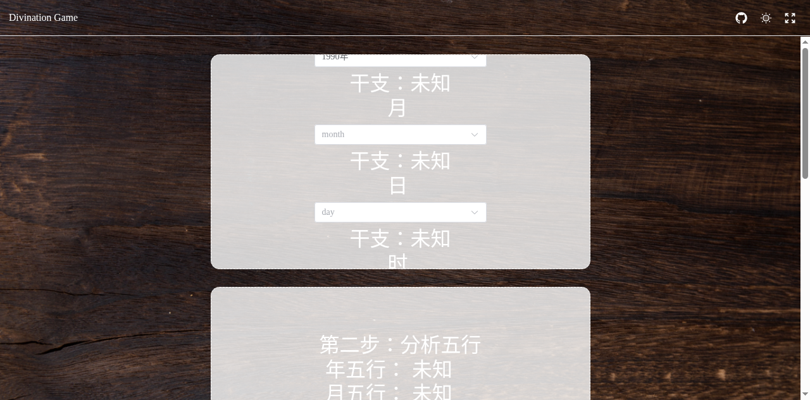

# 🔮 根据生辰八字占卜

一个基于 Vue 3 + Vite + UnoCSS 构建的生辰八字占卜 Web 应用。通过输入出生年月日时，自动推算对应的生辰八字、五行属性与十神关系，提供直观的可视化分析界面。

## 项目介绍

本项目是一个传统文化与现代前端技术结合的占卜小游戏，核心流程分为三步：

1. **获取生辰八字**：选择出生年、月、日、时，依据农历历法推算对应的干支（年柱、月柱、日柱、时柱）。
2. **分析五行**：根据八字干支推导出年、月、日、时各自的五行属性（金、木、水、火、土）。
3. **分析十神**：基于日干与其他干支的关系，推算十神（比肩、劫财、食神、伤官、偏财、正财、七杀、正官、偏印、正印）。

界面采用沉浸式全屏背景与卡片式步骤布局，并已适配桌面端与移动端响应式显示。

## 界面截图



## 技术栈

- **框架**：Vue 3 + Vue Router
- **构建工具**：Vite 5
- **原子化 CSS**：UnoCSS（preset-uno / preset-icons / preset-attributify）
- **UI 组件库**：Element Plus（按需自动导入）
- **八字历法库**：lunar-typescript
- **工具库**：VueUse
- **部署**：gh-pages

## 本地开发

```bash
# 安装依赖
pnpm install

# 启动开发服务器
pnpm dev

# 构建生产版本
pnpm build

# 本地预览构建产物
pnpm preview
```

## 部署

项目通过 `gh-pages` 部署到 GitHub Pages：

```bash
pnpm deploy
```

该命令会先执行 `build` 构建产物，再将 `dist` 目录推送到 `gh-pages` 分支。

## 在线访问

部署完成后，可通过 GitHub Pages 地址访问：
https://smallteddygames.github.io/divination-bazi/
